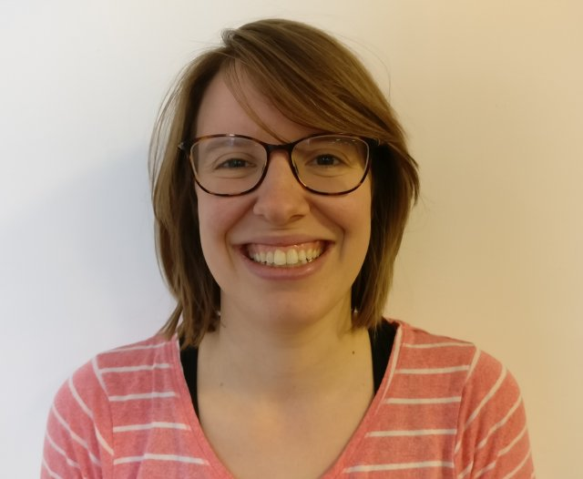

[Home](#Home) | [The Ward Round](#WardRound) | [The Team](#WardRound) | [Contribute](#Contribute)

# Next-Gen Patient Lists

Welcome to the next-generation patient list manager PatManPlus.

This will change the life of every junior doctor in the NHS.

## Purpose
The software is designed to allow junior doctors to manage their patient lists to provide an efficient way to complete a ward round and also manage the various jobs assigned to that ward. It replaces more archaic systems currently in place. Such as MS Word documents, MS Excel spreadsheets, MS Access databases and paper based alternatives. To find out more about the way this is managed see [The Ward Round](#WardRound).

## MVP
An MVP has been developed to allow replication of the current system. There are further features and improvements that have been identified within *issues*.

## Technology
PatManPlus is a program that will be stored on the network drive of a hospital, it is accessed using an _exe_ file. It has been created using Electron, JavaScript, HTML, CSS and SQLite. This allows it to be serverless which is one of the main requirements.

## Contribution
If you wish to contribute then please see the [contribution](#Contribute) section.

To communicate with the contributors please join the <a href="https://patmanplus.slack.com/messages/general/">Slack conversation</a>

GitHub: https://github.com/vvcb/PatManPlus

Fork, pull, push, commit, collaborate...

***

# The Ward Round

## What is the Ward Round?

The patients in hospital are all under the care of a team or a particular ward. The ward round is a process by which each patient gets a  visit by a doctor or a team of doctors each day. This daily visit allows for the whole team to catch up with how the patient is progressing, look at their latest test results, and make a plan for the following few days.  

## What are the current problems with the ward round?

With a healthcare system increasingly under strain in terms of numbers of patients, beds available and manpower, teams have become more responsible for more and more patients and these patients have been be spread out across many wards. This means that teams have to keep a list of patients, their locations and the current plan.

## How is this done now and why isn't it working?

Traditionally team have kept lists of patients on word documents, which are printed and on which junior doctors write the list of jobs that have been decided on the ward round. These jobs are then assigned to a team member by hand. These word documents are stored on the hospital shared drive and are updated daily usually at the end of the day and not in real time. However because doctors are often called away from their work when they are updating the list, these documents are often left open meaning that it cannot be accessed by anyone else except in read-only form. This means that the shared drive often ends up with multiple versions of the same patient list which can lead to errors.

## What do we need?

We need a patient list that can be updated in real-time on the ward round. This will allow jobs to be add more accurately and in a timely fashion. We also need a patient list that can be updated from multiple locations and can be sorted by ward, consultant and team. This will allow the ward round to be more efficient.

***

# The NHS Hack-Day Team

PatManPlus was developed over a weekend fuelled with plenty of crazy enthusiasm, coffee, fruit slices and just a little bit of alcohol by a team of software developers and doctors.

In no specific order of heirarchy (unsorted), the team members are:

## Richard Nienaber

A stray developer who loves a challenge!

## Olivier Kouame

Ex-SAS point man. Now children's book author. Fantasist. But really good developer! Some of this is true.

## Caylee Farndon-Taylor

Passionate about social fairness. UX expert. Checkout www.pariti.com 

## Lloyd Stevens

A secondary school assistant principal who leads on computer science and has an entrepreneurial spark.

## Caroline Morton

Medic. Keen coder. Likes to torture medical students by teaching them to code. Checkout www.computational-medicine.com.

## Vishnu V Chandrabalan

Surgeon. Unhinged when not operating. Pretends a lot to know how to code.

***

# Contributing Guidelines for PatManPlus

Firstly thank you so much for considering to contribute on this project. Before you do so can you please ensure you read through these guidelines so that you understand the situation around the problem at hand.

## Restrictions of a Hospital

Obviously there are various restrictions in place within hospitals in terms of security and the ability to install and access software. Please be aware of this, read through the detail within [The Ward Round](#WardRound) to fully understand the current problem. Also note it is not always possible to install new software on hospital servers. The system needs to be accessible on a shared network drive but accessible through a simple interface. This is why the approach has been taken to produce an _exe_ file that can be accessed through the network drives in a hospital. Note that the system will be standalone for each ward that wishes to use it. There is no need have them talk to each other.

## Features required

All features that are required have been listed within _Issues_. Please read through these, if you can contribute to these features then this would be fantastic. Please can you follow the process below

-  open the _issue_ that relates to the feature you wish to work on
-  in this _issue_ please comment that you would like to work on it
-  one of the maintainers will label the issue as being _worked on_
-  you are then free to work on the feature and submit a pull request referencing the issue

You can also get further clarification by requesting to join the <a href="https://patmanplus.slack.com/messages/general/">Slack message group</a> for this project.

## New Feature Suggestions

Before you suggest a new feature please read through the _issue_ lists of to see if your feature isn't already in place or in development. If you decide the feature is new then please follow the steps below

-  raise your feature as an _issue_ through GitHub
-  these will be reviewed to decide upon the suitability for the hospital environment
-  if accepted the label of  the _issue_ will be changed to _worked on_
-  it will then be assigned to you accordingly if accepted.

## Bugs

When reporting a bug through a new _issue_ please put the detail below and respond in line accordingly

-  what is the current behavior?
-  if the current behavior is a bug, please provide the steps to reproduce.
-  what is the expected behavior?
-  please mention your operating system version and the version of PatManPlus.
